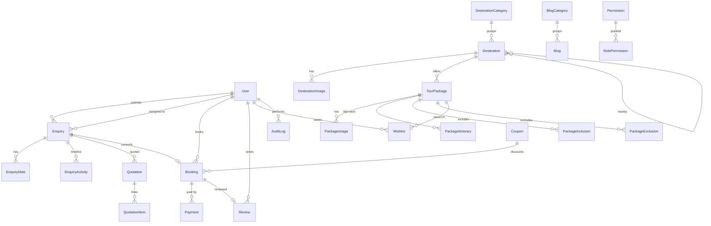

# ER diagram

```mermaid
erDiagram
  User ||--o{ Enquiry : submits
  User ||--o{ Enquiry : "assigned to"
  User ||--o{ Booking : books
  User ||--o{ Review : writes
  User ||--o{ Wishlist : saves
  User ||--o{ AuditLog : performs
  DestinationCategory ||--o{ Destination : groups
  Destination ||--o{ DestinationImage : has
  Destination ||--o{ TourPackage : offers
  Destination }o--o{ Destination : nearby
  TourPackage ||--o{ PackageImage : has
  TourPackage ||--o{ PackageItinerary : "day-wise"
  TourPackage ||--o{ PackageInclusion : includes
  TourPackage ||--o{ PackageExclusion : excludes
  TourPackage ||--o{ Wishlist : "saved in"
  Enquiry ||--o{ EnquiryNote : has
  Enquiry ||--o{ EnquiryActivity : timeline
  Enquiry ||--o{ Quotation : quoted
  Quotation ||--o{ QuotationItem : lines
  Enquiry ||--o| Booking : converts
  Booking ||--o{ Payment : "paid by"
  Booking ||--o| Review : reviewed
  Coupon ||--o{ Booking : discounts
  BlogCategory ||--o{ Blog : groups
  Permission ||--o{ RolePermission : granted
```
